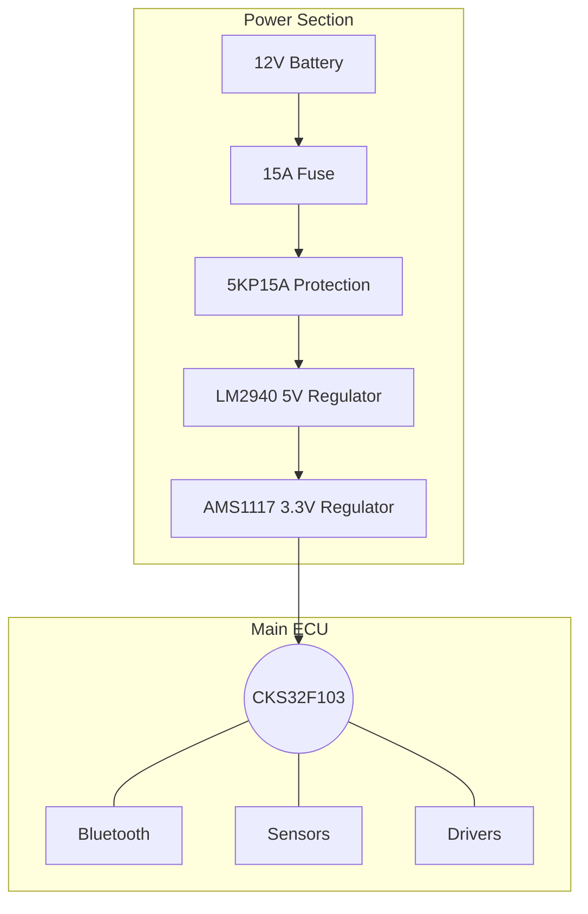

# CKS32F103 Professional ECU (CBT6 / C8T6)

This document details the professional-grade ECU build using the **CKS32F103CBT6** (128KB Flash) or **CKS32F103C8T6** (64KB Flash). This design is optimized for your **CNC 3018 Pro** and aims for compatibility with modern 3/4 cylinder engines (Chevrolet Optra, Hyundai Elantra/Accent/Tucson).

---

## 🛒 1. Professional Parts List (SMD/THT Mix)

This list is optimized for CNC milling. High-current parts are THT for strength, while logic parts are SMD (SOIC/0805) to keep the board compact.

- **Master BOM (CSV):** **[cks_ecu_pro_bom_egypt.csv](file:///Users/ebramdawood/Documents/trae_projects/Regata%20SS/cks_ecu_pro_bom_egypt.csv)** (Includes local Egypt replacements).

| Category | Component | Package | Qty | Purpose |
| :--- | :--- | :--- | :--- | :--- |
| **Brain** | **CKS32F103CBT6** | LQFP-48 | 1 | 128KB Flash version (Recommended). |
| **Power** | **LM2940-5.0** | TO-220 | 1 | Automotive 5V regulator (better than 7805). |
| **Power** | **AMS1117-3.3** | SOT-223 | 1 | 3.3V for MCU. |
| **Power** | **5KP15A** | Axial | 1 | Massive TVS Surge Protection. |
| **Drivers** | **IRLZ44N** | TO-220 | 4 | Injectors (Cyl 1, 2, 3, 4). |
| **Drivers** | **ISL9V5036P3** | TO-220 | 2 | Ignition IGBTs (Wasted Spark). |
| **Inputs** | **MAX9926** | QSOP-16 | 1 | Dual VR/Hall Crank/Cam Conditioner (Pro Choice). |
| **Comms** | **HC-05 / HC-06** | Module | 1 | **Bluetooth** for Mobile App connection. |
| **Turbo** | **IRLZ44N** | TO-220 | 1 | **Boost Control Solenoid** (Optional). |
| **Aux** | **VNP14N04** | TO-220 | 2 | Protected low-side switches for Fan/Pump. |

---

## 🔌 2. Modern Vehicle Connectors

For modern cars like the **Chevrolet Optra** or **Hyundai (Elantra/Accent)**, we want to match the robustness of their factory connectors.

### 2.1 The "Junkyard Pro" Strategy
Instead of buying expensive new connectors, go to a scrap yard and cut the ECU connector (the female socket on the ECU) from:
- **Chevrolet Optra (Daewoo/GM):** Look for the 121-pin or 80-pin connectors.
- **Hyundai Elantra/Accent/Tucson:** These often use the **Bosch ME7** style (121-pin) or **Kefico** (similar to Bosch).

### 2.2 Standard Pinout for 3 & 4 Cylinders

| Pin Group | Pins | Function |
| :--- | :--- | :--- |
| **Power** | 1, 2 | 12V Constant (Battery). |
| **Power** | 3 | 12V Switched (Ignition Key). |
| **Ground** | 4, 5, 6 | Power Ground (Chassis/Engine Block). |
| **Sensors** | 7, 8, 9 | Sensor Ground (Isolated from Power Ground). |
| **Ignition** | 10, 11 | Coil 1&4, Coil 2&3 (or 3 individual for Alto). |
| **Injection** | 12, 13, 14, 15 | Injector 1, 2, 3, 4. |
| **RPM** | 16, 17 | Crank Sensor (+ / -). |
| **Turbo** | 18 | Boost Control Output (PWM). |

---

## 📱 3. Bluetooth & Mobile Interface

To connect to a mobile app in the future:
1.  **Hardware:** The **HC-05** module connects to **UART1 (PA9/PA10)**.
2.  **Protocol:** It will broadcast standard "Speeduino" or "MS2Extra" serial data.
3.  **Apps:** You can use **RealDash** or **Shadow Dash MS** on Android today!

---

## 🗺️ 4. Professional Connection Diagram

You can find the high-quality, detailed connection diagram in the following file:
- **[Detailed ECU Connection Diagram (draw.io)](file:///Users/ebramdawood/Documents/trae_projects/Regata%20SS/cks_ecu_diagram.drawio)**

*(You can open this file in any web browser at [draw.io](https://app.diagrams.net/) to view or edit the professional layout).*

### 4.1 Quick Overview (Simplified)

---

## 🛠️ 5. CNC Manufacturing (Trial 2)
This board will be your first **"Full CNC"** project. 
1.  **Isolation Milling:** Use a **20° 0.1mm V-Bit** for the LQFP-48 pads.
2.  **Top Layer:** All SMD components (MCU, Multiplexer, small caps/resistors).
3.  **Bottom Layer (or Jumper Wires):** Power traces and THT connectors.
4.  **Auto-Leveling:** **CRITICAL!** You must use "Candle" or "OpenCNCPilot" to probe the copper surface before milling the fine-pitch MCU pads.
